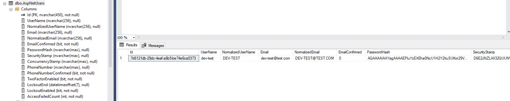

#Entity Framework Demo (efdemo)
There is a small project using EF and basic CRUD APIs.

#### Swagger

- Swagger documentation is set up and could be accessed using url `https://localhost:5001/swagger/index.html`

#### .NET 8 build-in Auth

**_ Note that API has been upgraded to .NET 8 first _**

- This is an out-of-the-box setup for .NET 8 Auth whish has become very handly. The Postman collection is stored in a /Postman folder.
  Setup is quite easy and you would need to use `IdentityDbContext` with `IdentityUser`
  

#### Testcontainers Note

**_ This is wip _**

- todo: `RepositoryTests` needs to be fixed due to the Auth change.

If tests are not running with exception about Docker unauthorised login password,
try to run the command:

```
docker login index.docker.io
```

#### Use Microsoft.AspNetCore.OpenApi instead of Swagger

The projects were upgraded to .NET 9 and Microsoft.AspNetCore.OpenApi nuget package got installed.

[Get started with Microsoft.AspNetCore.OpenApi](https://learn.microsoft.com/en-us/aspnet/core/fundamentals/minimal-apis/aspnetcore-openapi?view=aspnetcore-9.0&tabs=netcore-cli)

To make it work, firstly the nuget packages of the projects were upgraded to laatest.
The tools needs to be installed globally:

```
dotnet tool install -g Microsoft.dotnet-openapi
```

The VS Code and Visual Studio were complaning about new registrations of `OpenApi` even after upgrading all packages and it was fix after the command was run:

```
dotnet add package Microsoft.AspNetCore.OpenApi --prerelease
```

To configure the OpenApi, there are settings that are added to `Program.cs`

```
builder.Services.AddOpenApi();
```

And UI part is configured:

```
app.MapOpenApi();
```
Also, we want to start our API with a page similar to what we had with swagger. Go to launchsettings and setup the application launchUrl:
```
    "launchUrl": "openapi/v1.json",
```